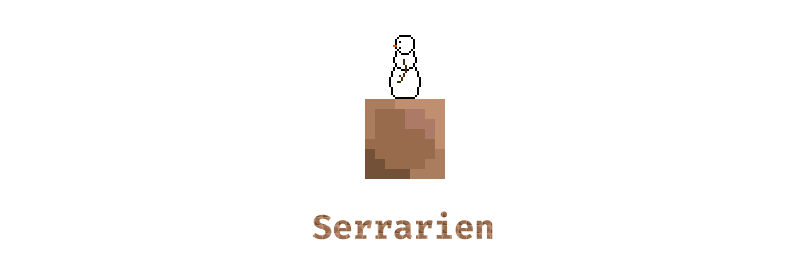

# Serrarien
Serrarien is a 2D survival game inspired by Terraria. It is open-source
and entirely made in C++17.

## How to compile
Compiling is pretty simple thanks to cmake. Just clone the repo, go to
the newly created folder and launch the following command:
```shell
cmake -B build && cmake --build build
```
You can then launch the game with `./build/Serrarien`

## Third party
Serrarien uses the following libraries:

- **OpenGL**: 2D rendering
- **GLFW**: Window management
- **STB**: image loading
- **GLM**: matrix and vector computations

The Noto Sans Light bitmap font has been generated with CBFG.

## Licensing
This project is distributed under the MIT License. See
[LICENSE](LICENSE) for further details.

**Noto is a trademark of Google Inc.** Noto fonts are open source. All
Noto fonts are published under the
[SIL Open Font License, Version 1.1][2].

[1]: res/banner-480x270.png
[2]: http://scripts.sil.org/cms/scripts/page.php?site_id=nrsi&id=OFL